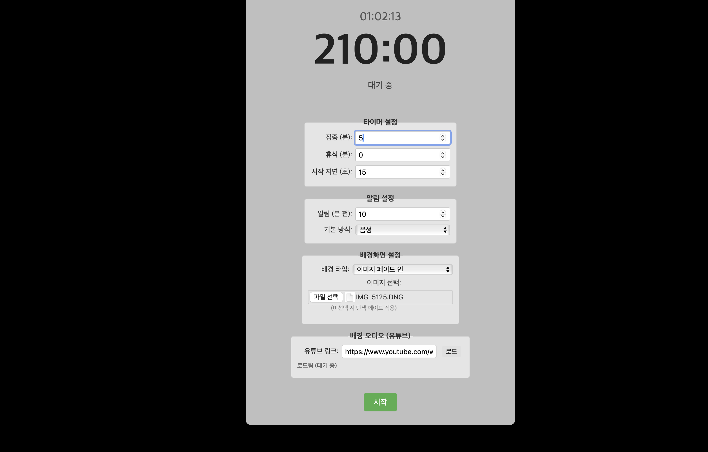
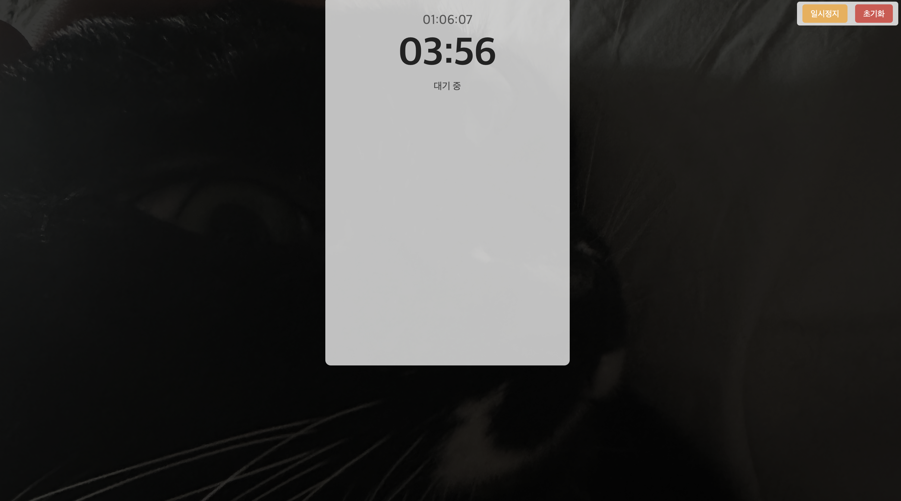

# 향상된 포모도로 타이머 (Pomodoro Timer with Enhancements)

집중력 향상과 시간 관리를 위한 웹 기반 포모도로 타이머 애플리케이션입니다. 사용자가 직접 타이머 시간, 알림, 배경화면, 배경 오디오 등을 설정하여 개인에게 최적화된 작업 환경을 만들 수 있습니다.

[](https://jeong-sungmin.github.io/pomodorotimer_withIMG/)

![타이머 설정 화면]
![타이머 실행 화면 ]!

## ✨ 주요 기능

- **사용자 설정 타이머:** 집중 시간과 휴식 시간을 분 단위로 자유롭게 설정 (휴식 시간을 0분으로 설정하면 단일 타이머처럼 작동).
- **시작 지연:** 타이머 시작 전 설정한 시간(초)만큼 동적으로 카운트다운 대기 ("3...", "2...", "1...").
- **배경화면 진행 표시:** 타이머 진행률에 따라 배경이 변화하는 효과 제공.
  - **단색 페이드:** 사용자가 **시작 색상**과 **종료 색상**을 선택하면, 시간이 흐름에 따라 시작 색상에서 종료 색상으로 점진적으로 전환 (기본: 검정 -> 흰색).
  - **이미지 페이드 인:** 사용자가 이미지를 업로드하면, 타이머 시작 시 검정 배경에서 이미지가 점차 투명도를 높이며 나타남 (이미지 미선택 또는 로드 실패 시 설정된 단색 페이드 효과로 자동 전환).
- **유튜브 배경 오디오:**
  - 유튜브 링크를 입력하여 영상의 오디오만 배경으로 재생 (**주의:** 유튜브 정책상 **광고가 나올 수 있으며**, 일부 영상은 외부 재생이 제한될 수 있음. 재생 불가 시 오류 메시지 표시).
  - 타이머 시간보다 영상 길이가 짧을 경우 자동 반복 재생.
  - 알림 발생 시 (팝업, 소리, 음성) 자동으로 일시 정지 후 알림 끝나면 재개.
- **종료 전 알림 (X분 전):** 설정한 시간(분) 전에 **깜빡이는 팝업**으로 알림이 표시되고 약 3초 후 자동으로 닫힘 (사용자 설정 알림 방식과 무관하게 작동).
- **타이머 종료 알림:** 타이머가 00:00이 되면 **'삐' 소리** 알림 발생 (사용자 설정 알림 방식과 무관하게 작동).
- **동적 UI:** 타이머 실행 중에는 설정 영역이 숨겨지고 컨트롤 패널의 크기가 작아지며, 일시정지/초기화 버튼이 우상단으로 이동하여 집중 환경 제공.
- **현재 시각 표시:** 타이머와 함께 현재 시각을 실시간으로 표시.
- **기타 알림 방식 설정:** 종료 전/종료 시 알림 외에 다른 알림(현재는 없음)이 필요할 경우를 대비하여 기본 알림 방식(팝업, 삐 소리, 음성) 설정 옵션 제공.

## 🚀 사용 방법

1.  **애플리케이션 접속:** [https://jeong-sungmin.github.io/pomodorotimer_withIMG/](https://jeong-sungmin.github.io/pomodorotimer_withIMG/) 링크를 통해 웹사이트에 접속합니다.
2.  **타이머 설정:** 원하는 집중 시간, 휴식 시간, 시작 지연 시간을 설정합니다.
3.  **알림 설정:** '종료 알림 (분 전)' 시간을 설정합니다. (참고: '알림 방식' 설정은 현재 종료 전/종료 시 알림에는 적용되지 않습니다.)
4.  **배경화면 설정:** '단색 페이드' 또는 '이미지 페이드 인' 중 원하는 타입을 선택합니다.
    - '단색 페이드' 선택 시, **시작 색상**과 **종료 색상**을 색상 선택기로 지정합니다.
    - '이미지 페이드 인' 선택 시, '이미지 선택' 버튼을 눌러 파일을 업로드합니다. (미선택 시 단색 페이드 적용)
5.  **(선택 사항) 유튜브 배경 오디오 설정:** 원하는 유튜브 영상 링크를 입력하고 '로드' 버튼을 클릭합니다. 상태 메시지를 통해 로딩 여부 및 재생 가능 여부을 확인합니다. - 광고는 최대 30초 정도 재생됩니다.
6.  **타이머 시작:** '시작' 버튼을 클릭하면 설정된 지연 시간 카운트다운 후 타이머가 시작됩니다.
7.  **타이머 제어:**
    - **일시정지/재개:** 우상단의 '일시정지' 또는 '재개' 버튼을 클릭합니다.
    - **초기화:** 우상단의 '초기화' 버튼을 클릭하여 모든 설정을 유지한 채 타이머를 초기 상태로 되돌립니다 (유튜브 오디오는 정지됨).

## 🛠️ 사용된 기술

- HTML5
- CSS3 (Animation, Transition 포함)
- JavaScript (ES6+)
- YouTube IFrame Player API (배경 오디오 재생)
- Web Audio API ('삐' 소리 생성)
- Web Speech API (SpeechSynthesis - 음성 알림)

## 💻 로컬에서 실행하기

1.  이 저장소를 로컬 컴퓨터에 클론(clone) 받거나 다운로드합니다.
    ```bash
    git clone https://github.com/Jeong-Sungmin/pomodorotimer_withIMG.git
    cd pomodorotimer_withIMG
    ```
2.  **로컬 웹 서버**를 실행합니다. (유튜브 API 등 외부 스크립트 로딩 및 API 제약으로 인해 `file:///` 프로토콜로는 정상 작동하지 않을 수 있습니다.)
    - **Python 3 사용 시 (권장):**
      ```bash
      python -m http.server
      # 또는 python3 -m http.server
      ```
    - **Node.js 사용 시:**
      ```bash
      # serve 패키지 설치 (최초 1회)
      # npm install -g serve
      serve .
      ```
    - **VS Code Live Server 확장 프로그램** 사용
3.  웹 브라우저를 열고 로컬 서버 주소(보통 `http://localhost:8000` 또는 `http://127.0.0.1:8000`, 사용하는 서버에 따라 다름)로 접속합니다.

## 🌐 배포

이 애플리케이션은 **GitHub Pages**를 통해 [https://jeong-sungmin.github.io/pomodorotimer_withIMG/](https://jeong-sungmin.github.io/pomodorotimer_withIMG/) 주소로 배포되었습니다. 저장소의 `main` (또는 `master`) 브랜치에 푸시하면 자동으로 업데이트됩니다.

_이 README 파일은 사용자의 요구사항에 맞춰 AI가 작성하는 데 도움을 주었습니다._
